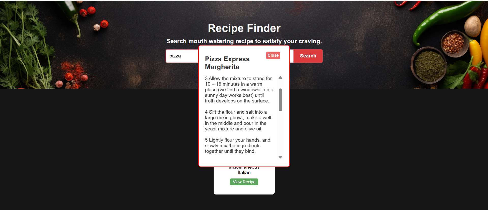
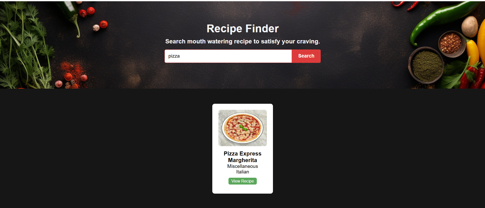

# 🍳 **Recipe Finder App**  

### Discover Delicious Recipes Instantly!  

Welcome to the **Recipe Finder App**, your one-stop solution to find mouthwatering recipes tailored to your taste buds! Powered by APIs, this project brings a world of culinary delights straight to your screen. Say goodbye to boring meals and hello to a vibrant menu of options with just a few clicks!  

---

## 🌟 **Why Use Recipe Finder?**  

Life is too short to eat the same thing every day. With Recipe Finder, you can:  
- Find recipes based on ingredients you already have.  
- Explore new cuisines and flavors effortlessly.  
- Get detailed cooking instructions, preparation time, and more!  

---

## 📸✨ **Screenshots**

---

## 🛠️ **Tech Stack**  

This app is built with love and modern technology:  

- **HTML5**: For a semantic structure.  
- **CSS3**: To create a visually stunning user interface.  
- **JavaScript**: For dynamic functionality and user interaction.  
- **API Integration**: Fetch real-time recipe data from a public recipe API.  

---

## ✨ **Features**  

🥗 **Ingredient-Based Search**: Enter ingredients you have, and get recipe suggestions instantly.  
🍝 **Cuisine Filters**: Filter recipes by cuisines like Italian, Indian, Mexican, and more.  
📋 **Detailed Recipe Information**: View step-by-step instructions, ingredient lists, and cooking times.  
⚡ **Fast & Responsive**: Optimized for all devices, ensuring a seamless experience everywhere. 
